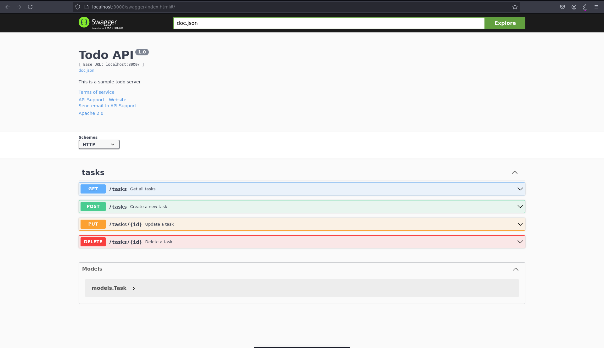

# todoGO

## Тестовое задание на создание таск менеджера на GO

### Список реализованных фич
- REST API на Fiber
- База дынныз PostgreSQL на Docker
- Swager документация
- CRUD-операции для задач


## Инструкции по установке и запуску

1. Перейдите в директорию docker
```bash
cd docker
```

2. Запуск Docker контейнера с Redis
```bash
sudo docker-compose up -d
```

3. Перейдите в корень проекта
```bash
cd ../
```

3. Установите зависимости
```bash
go mod tidy
```

4. Запуст HTTP API
```bash
go run main.go
```


### Документация: http://localhost:3000/swagger/index.html
